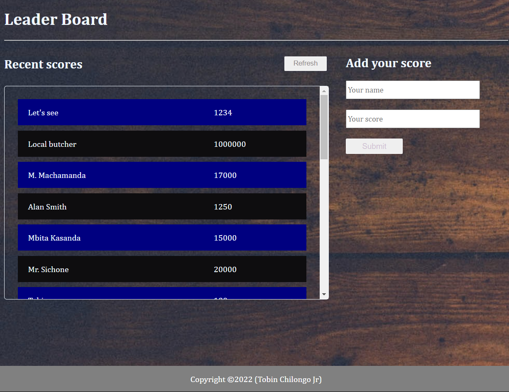

# LEADERBOARD

In this activity I am setting up a JavaScript project for the Leaderboard list app, using webpack and ES6 features, notably modules. I will develop a first working version of the app following a wireframe, but without styling - just focus on functionality. In following activities, I will consume the Leaderboard API using JavaScript async and await and add some styling.

## Live Demo


## SCREENSHOT



## Built With

- HTML
- CSS
- JavaScript
- Webpack

## Getting Started

To get a local copy up and running follow these simple example steps.

### Prerequisites

clone repo: `git clone https://github.com/Tobinchilongo/Leaderboard.git`

then
```
  cd leaderboard
  npm install
  npm start
```

## Authors

👤 **Tobin Chilongo Jr**

- GitHub: [@Tobinchilongo](https://github.com/Tobinchilongo)
- Twitter: [@Tobin_Official](https://twitter.com/Tobin_Official)
- LinkedIn: [LinkedIn](https://www.linkedin.com/in/tobin-chilongo-a6736415a/)

## 🤝 Contributing

Contributions, issues, and feature requests are welcome!

Feel free to check the [issues page](../../issues/).

## Show your support

Give a ⭐️ if you like this project!

## Acknowledgments

- Hat tip to anyone whose code was used
- Inspiration
- etc

## 📝 License

This project is [MIT](./MIT.md) licensed.
